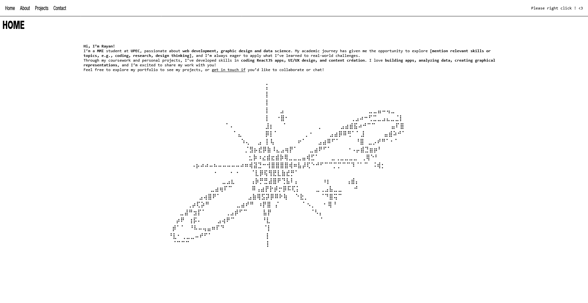

# Brutalist Portfolio

A minimalist and brutalist-inspired portfolio website. This project is designed to showcase my work in a raw, unapologetic, and visually striking way.

## Live Demo

[Link to live demo](https://rayan-boughalia.netlify.app/)

## Screenshot

## Features

* **Brutalist Design:** A raw and minimalist design that prioritizes content and functionality.
* **Custom Context Menu:** A custom context menu that appears on right-click, providing a unique navigation experience.
* **Expanding Sections:** Sections that expand and collapse to reveal content, keeping the interface clean and focused.
* **Carousel:** A simple carousel to showcase projects.
* **Responsive:** The portfolio is responsive and works on different screen sizes.

## Tech Stack

* **HTML5:** The standard markup language for creating web pages.
* **CSS3:** The stylesheet language used for describing the presentation of a document written in a markup language.
* **JavaScript:** The programming language that conforms to the ECMAScript specification.

## License

Distributed under the MIT License. See `LICENSE` for more information.
